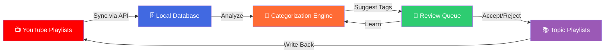
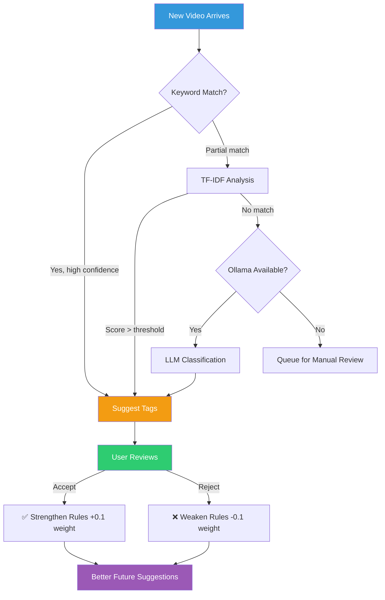
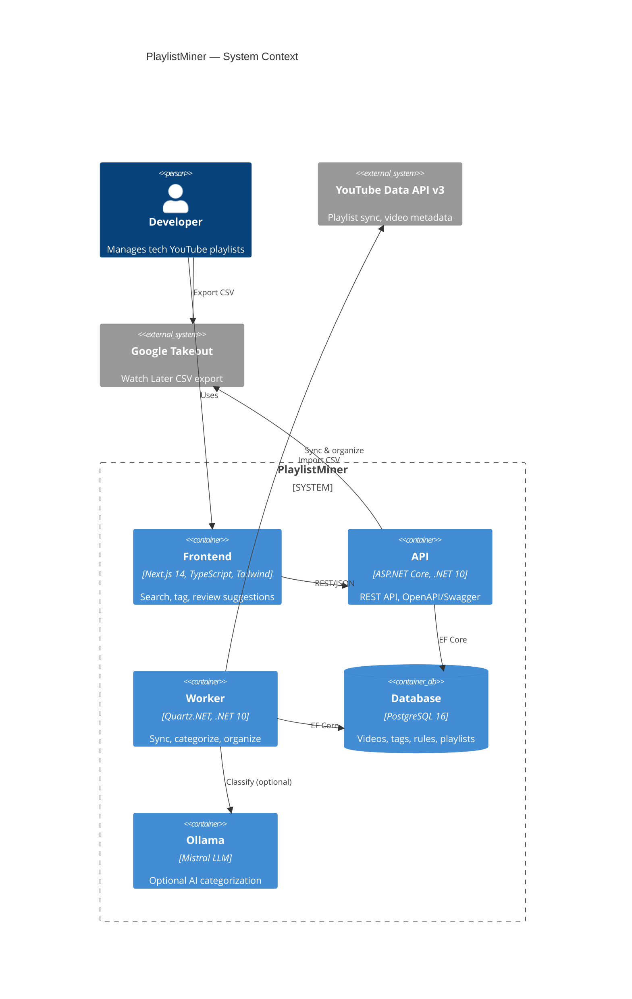
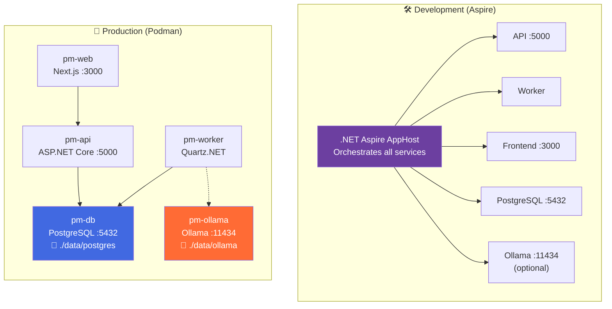
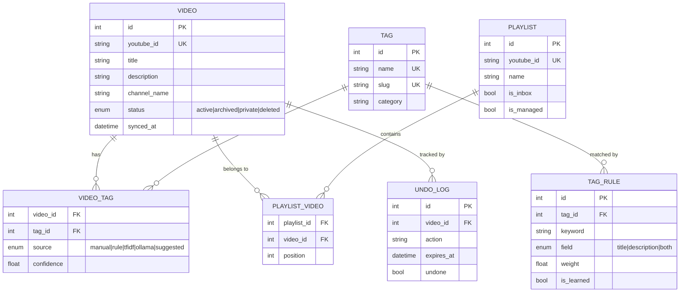
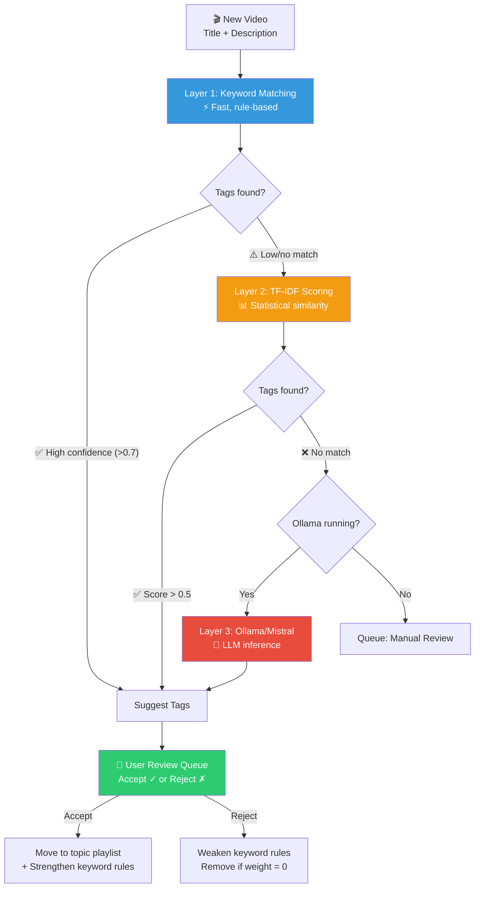
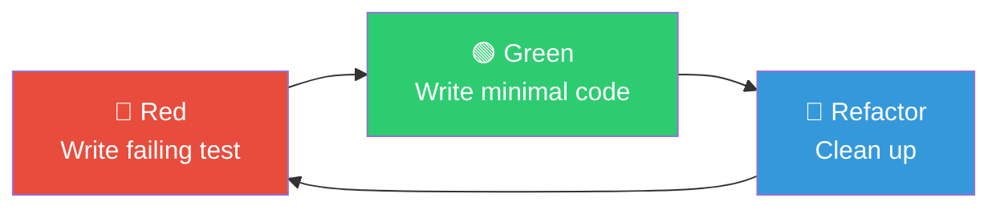
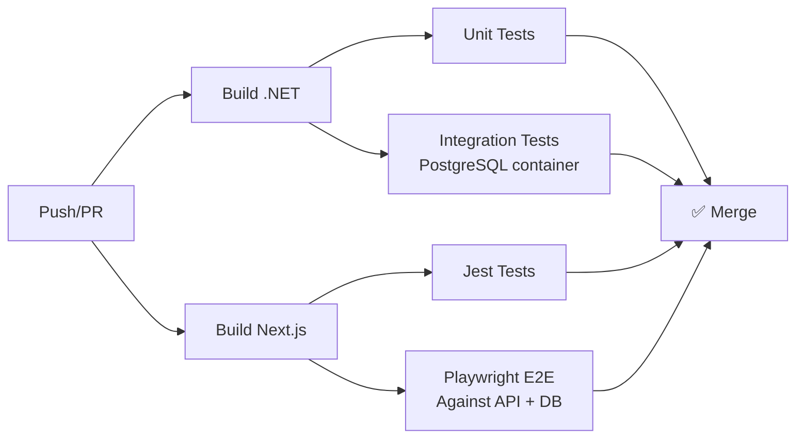

<p align="center">
  
</p>

<h1 align="center">PlaylistMiner</h1>

<p align="center">
  <strong>Intelligent YouTube playlist organizer that syncs, categorizes, and reorganizes your videos by topic</strong>
</p>

<p align="center">
  <a href="#-the-problem">Problem</a> &bull;
  <a href="#-how-it-works">Solution</a> &bull;
  <a href="#%EF%B8%8F-architecture">Architecture</a> &bull;
  <a href="#-quick-start">Quick Start</a> &bull;
  <a href="#-development">Development</a> &bull;
  <a href="#-testing">Testing</a> &bull;
  <a href="#-roadmap">Roadmap</a>
</p>

<p align="center">
  
  
  
  
  
  
  
</p>

---

## The Problem

If you learn tech through YouTube, you know this pain:

```
Your YouTube Playlists (right now)
├── "Watch Later"                    → 847 videos, mixed topics
├── "Good Stuff"                     → 213 videos, no theme
├── "React tutorials"                → has C#, AWS, and Docker videos too
├── "Dev Videos"                     → 500+ videos, completely unsearchable
├── "Cloud"                          → mix of AWS, Azure, GCP, Terraform
├── "Save for later"                 → you saved them. you never went back.
└── "Untitled Playlist"              → why does this exist
```

**The core problems:**

1. **No multi-tagging.** YouTube allows one playlist per video. A video about "Deploying React to AWS with Docker" belongs in 4 categories — but YouTube forces you to pick one.

2. **No search across playlists.** Want to find that OAuth tutorial you saved 6 months ago? Good luck scrolling through 800 videos in "Watch Later."

3. **No auto-organization.** Every video you save goes into a pile. Manual sorting is tedious, so you stop doing it, and the pile grows.

4. **Dead videos vanish silently.** Creators delete or private their videos. You never know what you lost.

## How It Works

PlaylistMiner solves this with a **sync-categorize-organize** pipeline:



**After PlaylistMiner:**

```
Your YouTube Playlists (organized)
├── 📥 Inbox                         → 12 new videos, pending review
├── 🏷️ React                        → 47 videos (also tagged: Frontend, JavaScript)
├── 🏷️ AWS                          → 38 videos (also tagged: Cloud, DevOps)
├── 🏷️ C#                           → 62 videos (also tagged: .NET, ASP.NET Core)
├── 🏷️ Docker & Kubernetes          → 29 videos (also tagged: DevOps, Cloud)
├── 🏷️ OAuth & Security             → 15 videos (also tagged: API, Backend)
├── 🏷️ System Design                → 22 videos (also tagged: Architecture)
└── 📦 Archived                      → 8 unavailable videos (metadata preserved)
```

### The Self-Learning Loop

PlaylistMiner gets smarter with every decision you make:



### Feature Highlights

| Feature | Description |
|---------|-------------|
| **Multi-tagging** | Each video gets multiple tags (React + Frontend + TypeScript). No more single-playlist limitation. |
| **Fuzzy search** | Find "that OAuth video" by typing "oarth" — PostgreSQL trigram matching handles typos. |
| **Smart categorization** | 3-layer pipeline: keyword rules → TF-IDF text analysis → optional Ollama/Mistral LLM. |
| **Self-learning** | Every accept/reject decision trains the engine. Keyword rules grow stronger or weaker. |
| **7-day undo** | Miscategorized? Undo any video move within 7 days. |
| **Dead video detection** | Deleted/privated videos auto-archived with metadata preserved. |
| **Watch Later import** | Google Takeout CSV import via CLI or drag-and-drop UI. |
| **Playlist consolidation** | Merge overlapping playlists into clean topic-based ones. |

---

## Architecture

### System Overview



### Container Architecture



### Tech Stack

| Layer | Technology | Purpose |
|-------|-----------|---------|
| **Frontend** | Next.js 14 + TypeScript + Tailwind CSS | Search, tag management, suggestion review |
| **API** | C# / .NET 10 / ASP.NET Core Web API | REST endpoints, OpenAPI spec generation |
| **Worker** | C# / .NET 10 / Quartz.NET | Scheduled sync, categorization, cleanup |
| **Orchestration** | .NET Aspire (dev) / Podman (prod) | Service discovery, health checks, telemetry |
| **Database** | PostgreSQL 16 + pg_trgm | Full-text search, fuzzy matching, data store |
| **ORM** | Entity Framework Core 10 | Code-first migrations, LINQ queries |
| **AI** | Ollama + Mistral (optional) | LLM fallback for unclassified videos |
| **API Client** | Auto-generated from OpenAPI | Type-safe frontend-backend communication |

### Database Schema



### Categorization Pipeline



---

## Quick Start

### Prerequisites

- [.NET 10 SDK](https://dotnet.microsoft.com/download/dotnet/10.0)
- [Node.js 20+](https://nodejs.org/)
- [Podman](https://podman.io/) (production) or .NET Aspire (development)
- [YouTube Data API v3](https://console.cloud.google.com/apis/library/youtube.googleapis.com) credentials

### 1. Clone and Configure

```bash
git clone https://github.com/ManikantaR/playlistminer.git
cd playlistminer
cp .env.example .env
```

Edit `.env`:

```env
POSTGRES_PASSWORD=your_secure_password
YOUTUBE_API_KEY=your_api_key
YOUTUBE_CLIENT_ID=your_oauth_client_id
YOUTUBE_CLIENT_SECRET=your_oauth_client_secret
```

### 2. Get YouTube API Credentials

1. Go to [Google Cloud Console](https://console.cloud.google.com/)
2. Create a project, enable **YouTube Data API v3**
3. Create an **API Key** (public metadata) and **OAuth 2.0 Client ID** (Desktop app)
4. Copy credentials to `.env`

### 3. Launch with Aspire (Development)

```bash
# Start everything: PostgreSQL, API, Worker, Frontend
dotnet run --project src/PlaylistMiner.AppHost

# With Ollama AI categorization
dotnet run --project src/PlaylistMiner.AppHost -- --EnableOllama=true
```

Aspire provisions PostgreSQL, injects connection strings, and starts all services. Dashboard URL appears in terminal output.

### 4. Launch with Podman (Production)

```bash
podman-compose up -d                      # Core services
podman-compose --profile ai up -d         # + Ollama
```

### 5. Connect and Organize

1. Open http://localhost:3000
2. **Settings** > **Connect YouTube** (OAuth flow)
3. **Playlists** > designate your **Inbox** playlist
4. **Dashboard** > **Sync Now**
5. **Suggestions** > review and accept/reject tags

### 6. Import Watch Later (Optional)

YouTube API blocks Watch Later access. Use [Google Takeout](https://takeout.google.com/) to export, then:

```bash
# CLI bulk import
dotnet run --project src/PlaylistMiner.CLI -- import-takeout --path /path/to/Takeout

# Or drag-and-drop CSV in the Import page
```

---

## Development

### Project Structure

```
playlistminer/
├── .github/
│   ├── copilot-instructions.md          # Copilot coding conventions
│   ├── prompts/                         # Implementation prompts (01-08)
│   ├── skills/                          # Copilot agent skills
│   ├── agents/                          # Copilot custom agents
│   ├── workflows/                       # GitHub Actions CI/CD
│   └── ISSUE_TEMPLATE/
├── .claude/
│   ├── CLAUDE.md                        # Claude Code context
│   ├── settings.json                    # Hooks configuration
│   ├── hooks/                           # Hook scripts
│   └── skills/                          # Claude Code skills
├── AGENTS.md                             # Shared agent instructions
├── docs/
│   ├── SPEC.md                          # Technical specification
│   └── ARCHITECTURE.md                  # Architecture decisions (ADRs)
├── src/
│   ├── PlaylistMiner.AppHost/           # .NET Aspire orchestrator
│   ├── PlaylistMiner.ServiceDefaults/   # Aspire shared config
│   ├── PlaylistMiner.Api/               # REST API (CLAUDE.md + AGENTS.md)
│   ├── PlaylistMiner.Worker/            # Background jobs (CLAUDE.md + AGENTS.md)
│   ├── PlaylistMiner.Core/              # Domain models, interfaces, DTOs
│   ├── PlaylistMiner.Infrastructure/    # EF Core, YouTube, categorization
│   ├── PlaylistMiner.CLI/               # Import CLI
│   └── web/                             # Next.js frontend (CLAUDE.md + AGENTS.md)
├── tests/
│   ├── PlaylistMiner.UnitTests/         # xUnit + FluentAssertions
│   └── PlaylistMiner.IntegrationTests/  # Testcontainers + PostgreSQL
└── podman-compose.yml
```

### Running Services Individually

```bash
# Backend API (needs PostgreSQL)
dotnet run --project src/PlaylistMiner.Api

# Worker (needs PostgreSQL)
dotnet run --project src/PlaylistMiner.Worker

# Frontend
cd src/web && npm install && npm run dev

# Generate TypeScript API client from Swagger
cd src/web && npm run generate-api
```

### AI-Assisted Development

This project is configured for both **GitHub Copilot CLI** and **Claude Code**:

| Tool | Config Location | Purpose |
|------|----------------|---------|
| Copilot CLI | `.github/copilot-instructions.md` | Coding conventions, architecture rules |
| Copilot Skills | `.github/skills/` | Specialized tasks (migrations, testing, components) |
| Copilot Prompts | `.github/prompts/` | Step-by-step implementation guides (01-08) |
| Copilot Agents | `.github/agents/` | Expert personas (.NET engineer, frontend) |
| Claude Code | `.claude/CLAUDE.md` | Project context, brainstorming |
| Claude Skills | `.claude/skills/` | Custom workflows (TDD, categorization, search) |
| Claude Hooks | `.claude/settings.json` | Auto-format, build validation, safety guards |
| Shared | `AGENTS.md` (root + per-project) | Agent instructions both tools read |

---

## Testing

This project follows **Red-Green-Refactor TDD**. Every feature starts with a failing test.



### C# Backend

| Type | Framework | Command |
|------|-----------|---------|
| Unit | xUnit + FluentAssertions + Moq | `dotnet test --filter "Category=Unit"` |
| Integration | xUnit + Testcontainers (real PostgreSQL) | `dotnet test --filter "Category=Integration"` |

### Next.js Frontend

| Type | Framework | Command |
|------|-----------|---------|
| Component | Jest + React Testing Library | `cd src/web && npm test` |
| E2E | Playwright | `cd src/web && npm run test:e2e` |

### CI Pipeline

GitHub Actions runs on every push and PR:



---

## Backup & Restore

```bash
# Backup
podman exec pm-db pg_dump -U pmuser playlistminer > backup_$(date +%Y%m%d).sql

# Restore
podman exec -i pm-db psql -U pmuser playlistminer < backup.sql
```

---

## Roadmap

### Phase 1 — Local Self-Hosted (Current)

- [x] Project specification and architecture
- [ ] .NET 10 solution with Aspire orchestration
- [ ] PostgreSQL schema with EF Core migrations
- [ ] YouTube API integration (sync + organize)
- [ ] 3-layer categorization engine
- [ ] REST API with OpenAPI/Swagger
- [ ] Next.js frontend with search and tag management
- [ ] Quartz.NET scheduler
- [ ] Google Takeout import (CLI + UI)
- [ ] Fuzzy search with pg_trgm

### Phase 2 — Cloud Deployment (Future)

- [ ] Firebase hosting (Cloud Run for containers)
- [ ] Firestore one-way push for read-heavy queries
- [ ] Firebase Auth for multi-user support
- [ ] Cloud Scheduler replacing Quartz.NET
- [ ] Firebase Hosting for Next.js static assets

---

## API Documentation

Swagger UI available at http://localhost:5000/swagger when the API is running.

---

## Contributing

This is currently a personal project. If you find it useful and want to contribute:

1. Fork the repo
2. Create a feature branch
3. Follow TDD — write failing tests first
4. Submit a PR with test evidence

---

## License

MIT License. See [LICENSE](LICENSE) for details.

---

<p align="center">
  Built with <a href="https://dotnet.microsoft.com/">.NET 10</a> + <a href="https://nextjs.org/">Next.js</a> + <a href="https://www.postgresql.org/">PostgreSQL</a>
  <br/>
  AI-assisted development with <a href="https://github.com/features/copilot">GitHub Copilot</a> + <a href="https://claude.ai/code">Claude Code</a>
</p>
